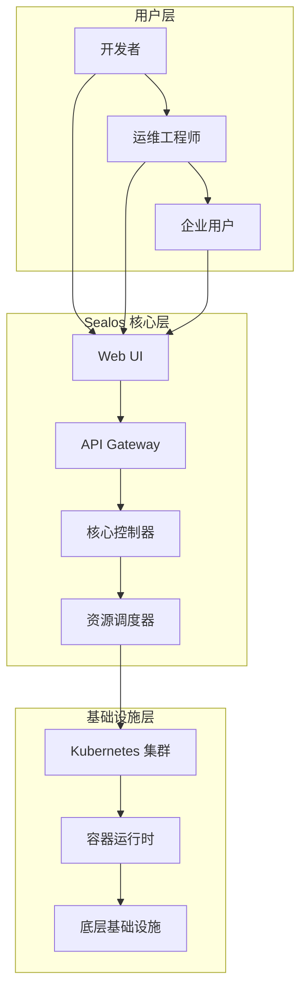

# Sealos 云原生技术博客文档集合

## 📖 项目简介

Sealos 云原生技术博客文档集合是 Sealos 官方的专业技术文档中心，致力于为开发者、运维工程师和企业用户提供全面、深入的云原生技术指导。本文档集合采用 **OpenSpec 规范驱动** 的文档管理体系，结合 **Obsidian 知识管理** 和 **Git 版本控制**，构建了现代化的技术文档协作平台。

### 🎯 核心价值

- **🏗️ 云原生架构**: 深入阐述 Sealos 在云原生领域的技术创新
- **📋 企业级方案**: 提供生产环境部署的最佳实践和解决方案
- **🔬 技术深度**: 覆盖从基础概念到高级应用的完整技术栈
- **🤝 开源协作**: 基于 OpenSpec 规范的社区协作开发模式
- **📚 知识沉淀**: 结构化的技术知识管理和经验分享

## 🏛️ 技术架构

### Sealos 平台概述

Sealos 是一个以 Kubernetes 为内核的云原生操作系统，通过声明式编程和云原生技术栈，为用户提供一站式云基础设施管理平台。



### 🔧 核心组件

| 组件                 | 功能描述           | 技术特性               |
| ------------------ | -------------- | ------------------ |
| **Sealos CLI**     | 命令行管理工具        | 集群管理、资源编排、应用生命周期管理 |
| **Desktop Client** | 桌面客户端          | 跨平台支持、图形化管理、实时监控   |
| **API Server**     | RESTful API 服务 | 高性能、可扩展、完整的 API 覆盖 |
| **Web Console**    | Web 管理界面       | 响应式设计、多租户支持、插件化架构  |

## 🛠️ 技术栈

### 后端技术栈

- **Go**: 主要编程语言，高性能并发处理
- **Kubernetes**: 容器编排和集群管理
- **Docker**: 容器化部署
- **gRPC**: 微服务间通信
- **etcd**: 分布式键值存储

### 前端技术栈

- **React**: 用户界面框架
- **TypeScript**: 类型安全的 JavaScript
- **Ant Design**: 企业级 UI 组件库
- **Zustand**: 状态管理
- **Vite**: 构建工具

### 基础设施

- **Helm**: Kubernetes 应用包管理

## 📚 文档导航

### 🚀 快速开始
- [环境准备](./docs/quickstart/environment.md) - 系统要求和依赖安装
- [安装指南](./docs/quickstart/installation.md) - 多种部署方式详解
- [首次使用](./docs/quickstart/getting-started.md) - 基础操作和配置
- [验证安装](./docs/quickstart/verification.md) - 功能测试和健康检查

### 🏗️ 核心概念
- [Sealos 架构](./docs/concepts/architecture.md) - 系统架构和设计原理
- [云原生基础](./docs/concepts/cloud-native.md) - 云原生技术概述
- [容器化技术](./docs/concepts/containers.md) - Docker 和容器最佳实践
- [Kubernetes 深度解析](./docs/concepts/kubernetes.md) - K8s 核心概念和机制

### 📦 部署指南
- [单节点部署](./docs/deployment/single-node.md) - 开发和测试环境
- [高可用集群](./docs/deployment/ha-cluster.md) - 生产环境部署
- [混合云部署](./docs/deployment/hybrid-cloud.md) - 多云环境管理
- [边缘计算](./docs/deployment/edge-computing.md) - 边缘节点部署

### 🛠️ 运维手册
- [集群管理](./docs/operations/cluster-management.md) - 集群运维和管理
- [监控告警](./docs/operations/monitoring.md) - 全方位监控解决方案
- [备份恢复](./docs/operations/backup-restore.md) - 数据备份和灾难恢复
- [性能调优](./docs/operations/performance.md) - 系统性能优化

### 💻 开发指南
- [API 文档](./docs/development/api.md) - RESTful API 和 SDK
- [插件开发](./docs/development/plugins.md) - 扩展插件开发指南
- [源码分析](./docs/development/source-code.md) - 核心代码解读
- [贡献指南](./docs/development/contributing.md) - 开源贡献流程

### 🏢 企业应用
- [行业案例](./docs/enterprise/use-cases.md) - 实际应用场景分析
- [最佳实践](./docs/enterprise/best-practices.md) - 企业级部署经验
- [安全指南](./docs/enterprise/security.md) - 安全配置和合规要求
- [成本优化](./docs/enterprise/cost-optimization.md) - 资源成本控制

## 🚀 快速入门

### 前置要求

- **操作系统**: Linux (推荐 Ubuntu 20.04+), macOS, Windows
- **Go 版本**: >= 1.19
- **Docker**: >= 20.10
- **Kubernetes**: >= 1.25 (可选，用于集群模式)
- **内存**: 至少 2GB RAM
- **存储**: 至少 10GB 可用空间

### 快速安装

```bash
# 使用脚本快速安装 Sealos
curl -sfL https://raw.githubusercontent.com/labring/sealos/main/scripts/install.sh |
  sh -s latest labring/sealos

# 验证安装
sealos version
```

## 🤝 参与贡献

我们采用 **OpenSpec 规范驱动** 的协作模式，确保每一次变更都有明确的需求和场景定义。

### OpenSpec 开发流程

1. **创建提案**: 使用 `/openspec:proposal` 创建变更提案
2. **规范设计**: 定义需求场景和技术规范
3. **实施开发**: 基于规范进行开发和测试
4. **代码审查**: 社区评审和质量检查
5. **合并发布**: 通过 CI/CD 流水线发布

### 贡献类型

- 📝 **文档贡献**: 修正错误、补充内容、翻译文档
- 🐛 **Bug 报告**: 发现并报告系统缺陷
- ✨ **功能开发**: 实现新功能和特性
- 🧪 **测试用例**: 编写自动化测试和用例
- 🎨 **设计优化**: UI/UX 改进和用户体验提升

### 代码规范

- **Go 代码**: 遵循 [Go Code Review Comments](https://github.com/golang/go/wiki/CodeReviewComments)
- **TypeScript**: 使用 ESLint + Prettier 进行代码格式化
- **文档格式**: 使用 Markdown，遵循中文技术文档规范
- **提交信息**: 使用 [Conventional Commits](https://www.conventionalcommits.org/) 规范

## 🌍 社区生态

### 技术社区

- **GitHub Discussions**: [技术讨论和问答](https://github.com/labring/sealos/discussions)
- **Discord 频道**: 实时技术交流 ([加入我们](https://discord.gg/wdUn538zVP))
### 联系方式

- **邮箱**:  cuisongliu@sealos.io
- **官方网站**: [https://sealos.io](https://sealos.io)
- **文档中心**:  [https://sealos.io/docs](https://sealos.io/docs)


## 📄 许可证

本项目采用 [Apache License 2.0](LICENSE) 许可证，允许自由使用、修改和分发。

## 🙏 致谢

感谢所有为 Sealos 项目做出贡献的开发者和社区成员。特别感谢：

- [Kubernetes 社区](https://kubernetes.io/) - 提供强大的容器编排基础
- [Docker 团队](https://www.docker.com/) - 容器化技术的先驱
- [CNCF 基金会](https://cncf.io/) - 云原生技术的推广和支持
- [所有开源贡献者](https://github.com/labring/sealos/graphs/contributors) - 代码和文档的贡献

---

<div align="center">

**🌟 如果这个项目对您有帮助，请给我们一个 Star！**

[](https://star-history.com/#labring/sealos&Date)

</div>