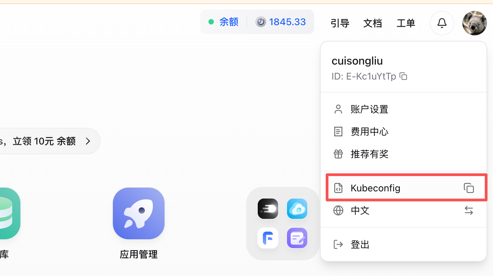
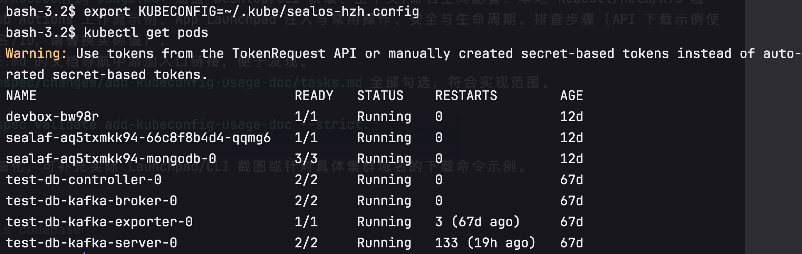
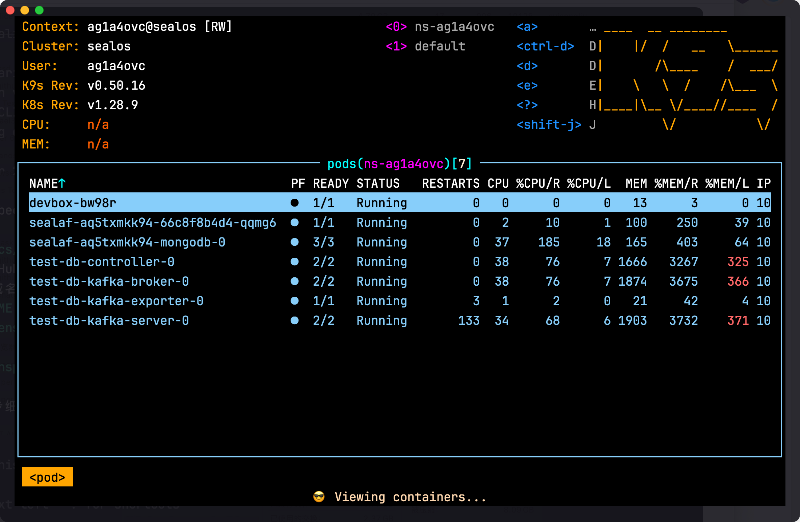
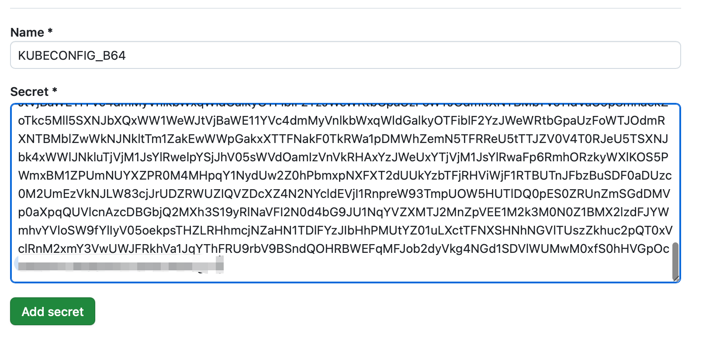
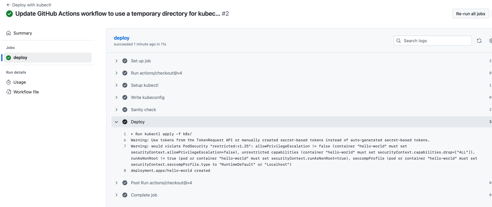
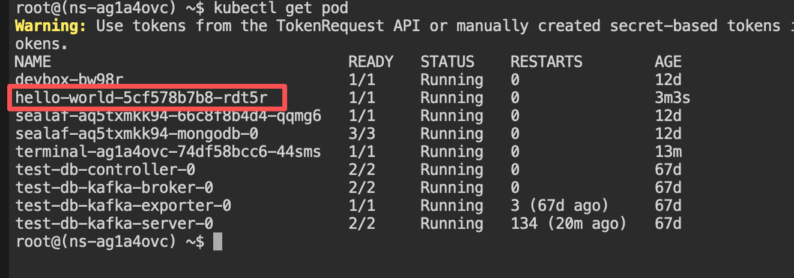

# Sealos 平台 kubeconfig 使用指南

面向希望在本地工具、CI/CD（GitHub Actions）、Sealos App Launchpad 中安全使用 kubeconfig 的用户。示例基于标准 Kubernetes 工具链，默认使用最小权限、限定命名空间的 kubeconfig。

## 1. 获取 kubeconfig

### 1.1 通过 Sealos Desktop 下载
- 登录进入 **Desktop Cloud** → **头像** -> **Kubeconfig**，点击**自动下载**或**复制**按钮。
  
- 下载后放置到安全位置，如 `~/.kube/sealos-<cluster>.config`，并限制权限 `chmod 600 <file>`。

### 1.2 下载kubectl工具

#### MacOS

```bash
   curl -LO https://dl.k8s.io/release/v1.28.0/bin/darwin/arm64/kubectl
```

#### Linux

```bash
curl -LO https://dl.k8s.io/release/v1.28.0/bin/linux/amd64/kubectl
```

#### Windows

```powershell
curl.exe -LO "https://dl.k8s.io/release/v1.28.0/bin/windows/amd64/kubectl.exe"
```

## 2. 本地工具使用与验证

### 2.1 设置 KUBECONFIG 与上下文
```bash
export KUBECONFIG=~/.kube/sealos-<cluster>.config
```

### 2.2 快速连通性检查
```bash
kubectl get pod
```

### 2.3 Helm 与 k9s
```bash
helm ls 
k9s 
```

## 3. CI/CD（GitHub Actions）示例

### 3.1 建议
- 将 kubeconfig base64 编码后存入 `Actions Secrets`（如 `KUBECONFIG_B64`）。Settings->Secrets and variables -> Actions ->  Repository secrets



### 3.2 最小示例 Workflow   

文件路径 .github/workflows/deploy-nginx.yml
```yaml
name: Deploy with kubectl  
  
on:  
  push:  
    branches:  
      - main  
jobs:  
  deploy:  
    runs-on: ubuntu-latest  
    env:  
      KUBECONFIG: /tmp/${{ github.run_id }}/kubeconfig  
    steps:  
      - uses: actions/checkout@v4  
      - name: Setup kubectl  
        uses: azure/setup-kubectl@v4  
      - name: Write kubeconfig  
        run: |   
          mkdir -p "$(dirname "$KUBECONFIG")"  
          echo "${KUBECONFIG_B64}" | base64 -d > "$KUBECONFIG"  
        env:  
          KUBECONFIG_B64: ${{ secrets.KUBECONFIG_B64 }}  
      - name: Sanity check  
        run: kubectl get pod  
      - name: Deploy  
        run: kubectl apply -f k8s/ 
```

### 3.3 nginx部署配置文件

```
apiVersion: apps/v1  
kind: Deployment  
metadata:  
  name: hello-world  
  labels:  
    app: hello-world  
spec:  
  replicas: 1  
  revisionHistoryLimit: 1  
  selector:  
    matchLabels:  
      app: hello-world  
  strategy:  
    type: RollingUpdate  
    rollingUpdate:  
      maxUnavailable: 0  
      maxSurge: 1  
  template:  
    metadata:  
      labels:  
        app: hello-world  
    spec:  
      automountServiceAccountToken: false  
      containers:  
        - name: hello-world  
          image: nginx  
          env: []  
          resources:  
            requests:  
              cpu: 20m  
              memory: 25Mi  
            limits:  
              cpu: 200m  
              memory: 256Mi  
          ports:  
            - containerPort: 80  
              name: port  
          imagePullPolicy: Always  
          volumeMounts: []  
      volumes: []
```

### 3.4  提交代码触发自动部署

- github action 日志正常部署执行
  
- sealos平台进入终端应用看pod是否正常启动/本地直接执行kubectl get pod 查看
	
   
## 4. Sealos App Launchpad 使用

 接口访问地址：``


###  4.1 获取Sealos Token

```
python3 -c "import urllib.parse, sys; print(urllib.parse.quote(sys.argv[1]))" "$(cat ~/.kube/sealos-hzh.config)"

```


### 4.2 访问 接口文档


- 在 Launchpad 创建/编辑应用时，将 kubeconfig 以 **Secret** 方式注入容器（文件挂载到 `/app/.kube/config` 或设置 `KUBECONFIG` 环境变量）。
- 为应用选择正确的 **context** 或默认命名空间，避免误操作其他集群/命名空间。
- 部署/调试常见操作：
  - 初始化：在启动脚本中执行 `kubectl get ns` 确认连通性。
  - 应用发布：`kubectl apply -f <manifest>` 或 `helm upgrade --install ...`。
  - 诊断：`kubectl describe pod/<name> -n <ns>`、`kubectl logs <pod> -n <ns>`。
- 如应用仅需访问单一命名空间，确保 kubeconfig 和 RBAC 仅授予该命名空间权限。


## 5. 常见问题与排查
- **证书过期/时钟偏差**：`kubectl config view --minify` 检查证书截止时间；确保 CI 机器 NTP 同步。
- **RBAC 拒绝**：`kubectl auth can-i <verb> <resource> ；调整角色或命名空间。
- **网络不通/域名解析失败**：在 runner 或容器中 `curl -k https://<domain>:6443` 或 `ping <domain>；检查出站策略与代理。

## 6. 参考
- 更多 kubectl 用法：`kubectl -h`
- Sealos 官方文档: https://sealos.io/docs
