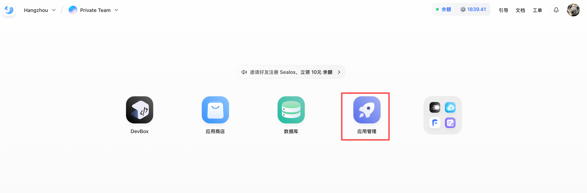
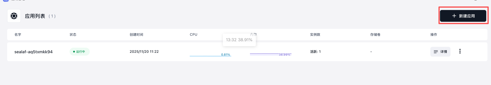
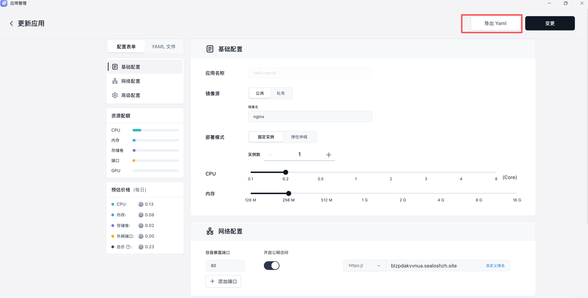

# Sealos 平台 kubeconfig 使用指南

面向希望在本地工具、CI/CD（GitHub Actions）、Sealos App Launchpad 中安全使用 kubeconfig 的用户。示例基于标准 Kubernetes 工具链，默认使用最小权限、限定命名空间的 kubeconfig。

## 1. 获取 kubeconfig

### 1.1 通过 Sealos Desktop 下载
- 登录进入 **Desktop Cloud** → **头像** -> **Kubeconfig**，点击**自动下载**或**复制**按钮。
  
- 下载后放置到安全位置，如 `~/.kube/sealos-<cluster>.config`，并限制权限 `chmod 600 <file>`。

### 1.2 下载kubectl工具

#### MacOS

```bash
   curl -LO https://dl.k8s.io/release/v1.28.0/bin/darwin/arm64/kubectl
```

#### Linux

```bash
curl -LO https://dl.k8s.io/release/v1.28.0/bin/linux/amd64/kubectl
```

#### Windows

```powershell
curl.exe -LO "https://dl.k8s.io/release/v1.28.0/bin/windows/amd64/kubectl.exe"
```

## 2. 本地工具使用与验证

### 2.1 设置 KUBECONFIG 与上下文
```bash
export KUBECONFIG=~/.kube/sealos-<cluster>.config
```

### 2.2 快速连通性检查
```bash
kubectl get pod
```

### 2.3 Helm 与 k9s
```bash
helm ls 
k9s 
```

## 3. CI/CD（GitHub Actions）示例

示例代码仓库： https://github.com/labring-sigs/using-kube-sealos

### 3.1 建议
- 将 kubeconfig base64 编码后存入 `Actions Secrets`（如 `KUBECONFIG_B64`）。Settings->Secrets and variables -> Actions ->  Repository secrets


### 3.2 最小示例 Workflow   

文件路径 .github/workflows/deploy-nginx.yml
```yaml
name: Deploy with kubectl  
  
on:  
  push:  
    branches:  
      - main  
jobs:  
  deploy:  
    runs-on: ubuntu-latest  
    env:  
      KUBECONFIG: /tmp/${{ github.run_id }}/kubeconfig  
    steps:  
      - uses: actions/checkout@v4  
      - name: Setup kubectl  
        uses: azure/setup-kubectl@v4  
      - name: Write kubeconfig  
        run: |   
          mkdir -p "$(dirname "$KUBECONFIG")"  
          echo "${KUBECONFIG_B64}" | base64 -d > "$KUBECONFIG"  
        env:  
          KUBECONFIG_B64: ${{ secrets.KUBECONFIG_B64 }}  
      - name: Sanity check  
        run: kubectl get pod  
      - name: Deploy  
        run: kubectl apply -f k8s/ 
```

### 3.3 nginx部署配置文件

```
apiVersion: apps/v1
kind: Deployment
metadata:
  name: hello-nginx
  labels:
    app: hello-nginx
spec:
  replicas: 1
  revisionHistoryLimit: 1
  selector:
    matchLabels:
      app: hello-nginx
  strategy:
    type: RollingUpdate
    rollingUpdate:
      maxUnavailable: 0
      maxSurge: 1
  template:
    metadata:
      labels:
        app: hello-nginx
    spec:
      automountServiceAccountToken: false
      containers:
        - name: hello-nginx
          image: nginx
          env: []
          resources:
            requests:
              cpu: 20m
              memory: 25Mi
            limits:
              cpu: 200m
              memory: 256Mi
          ports:
            - containerPort: 80
              name: port
          imagePullPolicy: Always
          volumeMounts: []
      volumes: []
```

### 3.4  提交代码触发自动部署

- github action 日志正常部署执行
  
- sealos平台进入终端应用看pod是否正常启动/本地直接执行kubectl get pod 查看
	
   
## 4. Sealos App Launchpad API 使用

 接口访问地址： `https://applaunchpad.<domain>/api/v2alpha/doc#tag/mutation`

###  4.1 获取Sealos Token

```
python3 -c "import urllib.parse, sys; print(urllib.parse.quote(sys.argv[1]))" "$(cat ~/.kube/sealos-<cluster>.config)"

```


### 4.2 访问 接口文档

注意：
1. HPA和replicas不能同时存在
2. 如果环境没有GPU，gpu.amount设置为0
3. 使用公有域名的场景需要先创建好后期再更新，需要提前获取portName，如果portName名字不存在则认为创建，否则认为更新
#### 创建资源

```
curl https://applaunchpad.hzh.sealos.run/api/v2alpha/app \
  --request POST \
  --header 'Content-Type: application/json' \
  --header 'Authorization: YOUR_SECRET_TOKEN' \
  --data '{
  "name": "hello-world-app",
  "image": {
    "imageName": "nginx"
  },
  "launchCommand": {},
  "quota": {
    "replicas": 1,
    "cpu": 0.2,
    "memory": 0.5,
    "gpu": {
      "vendor": "nvidia",
      "type": "",
      "amount": 0
    }
  },
  "ports": [
    {
      "number": 80,
      "protocol": "http",
      "isPublic": true
    }
  ],
  "env": [],
  "storage": [],
  "configMap": []
}'
```

#### 查询资源

```
curl https://applaunchpad.hzh.sealos.run/api/v2alpha/app/{name} \
  --header 'Authorization: YOUR_SECRET_TOKEN'
```


#### 更新资源

```
curl https://applaunchpad.hzh.sealos.run/api/v2alpha/app/{name} \
  --request PATCH \
  --header 'Content-Type: application/json' \
  --header 'Authorization: YOUR_SECRET_TOKEN' \
  --data '{
  "name": "hello-world-app",
  "image": {
    "imageName": "nginx"
  },
  "launchCommand": {},
  "quota": {
    "replicas": 1,
    "cpu": 0.2,
    "memory": 0.5,
    "gpu": {
      "vendor": "nvidia",
      "type": "",
      "amount": 0
    }
  },
  "ports": [
    {
      "number": 80,
      "protocol": "http",
      "isPublic": true,
      "name": "idekemqmnmhb"
    }
  ],
  "env": [],
  "storage": [],
  "configMap": []
}'
```


## 5. Sealos App Launchpad CI/CD 对接

### 5.1 登录sealos平台

### 5.2 新建应用


### 5.3 创建应用


### 5.4 导出配置
点击变更并导出yaml


### 5.5 对接GitHub Actions

```
name: Deploy app with kubectl  
  
on:  
  workflow_dispatch:  
jobs:  
  deploy:  
    runs-on: ubuntu-latest  
    env:  
      KUBECONFIG: /tmp/${{ github.run_id }}/kubeconfig  
    steps:  
      - uses: actions/checkout@v4  
      - name: Setup kubectl  
        uses: azure/setup-kubectl@v4  
      - name: Write kubeconfig  
        run: |   
          mkdir -p "$(dirname "$KUBECONFIG")"  
          echo "${KUBECONFIG_B64}" | base64 -d > "$KUBECONFIG"  
        env:  
          KUBECONFIG_B64: ${{ secrets.KUBECONFIG_B64 }}  
      - name: Sanity check  
        run: kubectl get pod  
      - name: Deploy  
        run: kubectl apply -f applaunchpad/hello-world.yaml
```


## 5. 常见问题与排查
- **证书过期/时钟偏差**：`kubectl config view --minify` 检查证书截止时间；确保 CI 机器 NTP 同步。
- **网络不通/域名解析失败**：在 runner 或容器中 `curl -k https://<domain>:6443` 或 `ping <domain>；检查出站策略与代理。

## 6. 参考
- 更多 kubectl 用法：`kubectl -h`
- Sealos 官方文档: https://sealos.io/docs
